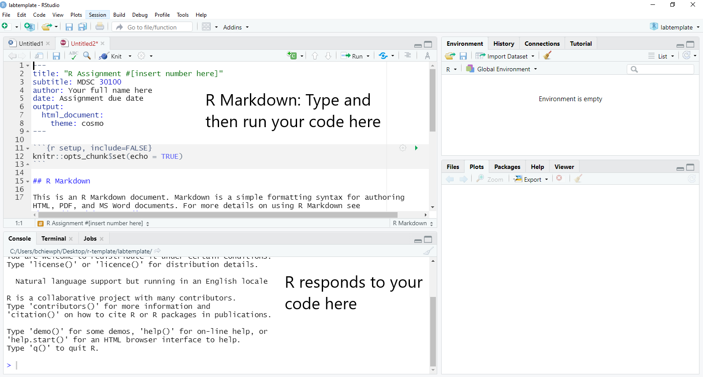
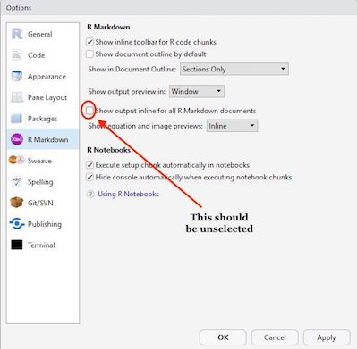

# R Assignments Instructions & R Markdown Tutorial

<a href="http://creativecommons.org/licenses/by-nc/4.0/" rel="license"></a>
This tutorial is licensed under a <a href="http://creativecommons.org/licenses/by-nc/4.0/" rel="license">Creative Commons Attribution-NonCommercial 4.0 International License</a>.

# Acknowledgements
These instructions were based off of Dr. Noli Brazil's <a href="https://crd150.github.io/hw_guidelines.html"> Assignment Guidelines for "CRD 150 - Quantitative Methods in Community Research." </a>

# Introduction/Summary

During the first half of the semester, a handful of classes will be devoted to increasing your comfort level and proficiency with using R/Rstudio. Assignments will be released during or after a “Lab/Exploration Day” (see <a href="https://docs.google.com/document/d/1KawpnImzubKawB5cPN-WXyKWmwjfK24sLVd_mTmG4mw/edit?usp=sharing"> syllabus </a> for reference). These assignments will be handed in:

1. an R Markdown format (.Rmd)
2. a knitted .html file

Markdown files should be submitted via Canvas by class time (1:59 PM) based on respective due dates (see <a href="https://docs.google.com/document/d/1KawpnImzubKawB5cPN-WXyKWmwjfK24sLVd_mTmG4mw/edit?usp=sharing"> syllabus </a> for reference).

You will use <a href="https://rmarkdown.rstudio.com/"> R Markdown </a> to write up all R related assignments. This guide will go through the steps for answering and submitting class assignment questions using R Markdown.

# Grading

In order to get full credit for each assignment, you will need to
1. Show the correct results for a given question (e.g. table, statistics, visualization).
2. Show the code producing the results.
3. Provide thoughtful/correct written answers.

Any response requiring a data analysis task must be supported by code you generate to produce your result. Just examining your various objects in the “Environment” section of R Studio is insufficient—you must use scripted commands. Because there are typically multiple ways to get an answer, we will not grade you on the efficiency of your code. You can work with other students but be sure to <strong>document/comment who you worked with in the assignments AND/OR mention resources your used that were not provided by this class (i.e., a webpage, book chapter, etc.). You must submit your own assignments.</strong>

Also note: all code used to produce your results must be shown in your HTML file (e.g., do not use ```echo=FALSE``` or ```include=FALSE``` as options anywhere). Other pieces of advice:

- Some of the questions in the R Assignments ask for "correct" answers. That is not to say, however, that I will not take into consideration "how much" of the code is "correct." If the answer is "wrong," expect some points taken off. 
- I will not grade on how efficient your code is unless stated so in the question. I will never take points off for accomplishing things differently than expected as long as it produces the correct result. <i>However</i>, if the answer is incorrect and your code indicates little effort (e.g. blank or a few lines of code that yield nothing), is completely incomprehensible (e.g. many lines of mish mash), and little to no commentary, expect few to no points.
- Please submit <i>both</i> an Rmd and html file.

The following page highlights instructions re: working with R Markdown (and how to produce ```.rmd``` and ```.html``` files).

# R Markdown

R Markdown is a simple formatting syntax for authoring html, pdf, and Microsoft Word documents in RStudio. 

These documents will provide us an easy-to-read document to grade; more importantly, you will get to practice (1) writing scripts, (2) keeping track of the analyses you run, and (3) organizing your output in a reader-friendly manner. When you submit these documents on Canvas, <strong> do not combine them into a zipped compressed folder </strong>. They should be two separate files.

To be clear, R is a <i>programming language</i>. RStudio is an <i>application</i>. R Markdown is a <i>markup syntax</i> to convert R script and text into a pdf or html document. It allows for presentation-ready documents that show commands and results in a seamless flow. When you write R code and embed it in presentation documents created using R Markdown, you are forced to explicitly state the steps you took to do your research.

In RStudio, install the packages <strong>knitr</strong> and <strong>rmarkdown</strong> using the ```install.packages()``` command. Type the following in your RConsole window after ```>```

```R
install.packages("knitr")
install.packages("rmarkdown")
```

Once you’ve installed these packages, you don’t need to install them any more in the future. You also do not need to load them in at any time using ```library()```.

# Opening an R Markdown File

An ```.Rmd``` template will be provided for each assignment. Download the week’s assignment template, which will be linked at the top of every assignment, and save it into an appropriate folder on your hard drive. File management is important here. Here are some tips.

1. Set up a clear and understandable hierarchical file system for this class on your hard drive. For example, create a class folder (MDSC 30100). Within this class folder, create the folder Assignments. Within the Assignments folder, create separate folders for each Assignment (e.g. Assignment 1, Assignment 2, …). Save that week’s assignment template here. When you knit your Rmd (we’ll get to what knitting means below), this is where your html file will go. Don’t work from your Desktop. Or from the Downloads folder. Or some randomly named folder that you will have a hard time finding a month, week or day from now.
2. To open an .Rmd file in RStudio, select File -> Open File and navigate to the folder you saved the assignment template in and select the file. You should see the R Markdown file pop up on the top left portion of your RStudio interface like below.



# Authoring an R Markdown document

R Markdown documents contain 3 major components:

1. A YAML header surrounded by - - -
2. Chunks of R code surrounded by ```
3. Text mixed with simple text formatting using the <a href="https://www.markdownguide.org/cheat-sheet/"> Markdown syntax</a>.

## YAML header
The YAML header controls how R Markdown renders your ```.Rmd``` file. A YAML header is a section of key:value pairs surrounded by - - - marks.

In the assignment template’s YAML, change your name, assignment number, lab number, and the date. Other than those items, <strong>the YAML format for each assignment is set for you in the template, so don’t change it</strong>. It will generally look like the following.

```{r}
---
title: "R Assignment #[insert number here]"
subtitle: MDSC 30100
author: Your full name here
date: Assignment due date
output: 
  html_document:
    theme: cosmo
---
```

# R Code chunks
When answering an assignment question, you’ll have the following sequence of components in your R Markdown document: Question, R code answering the question, and your text to explain the results. Let’s say you have the following question in one of your assignments.

```{r}
Q1

1+1

What does the above code do?
```

Assignments will ask you to write R code to accomplish a data analysis task. You present and execute your R code inside R code chunks. R chunks start with ````  ```{r} ````  and end with ```` ``` ```` , and you insert your R code in between. To designate ```1+1``` as R code, it will look like the following in your R Markdown document.

````{r}
```{r}
1+1
```
```` 

All code inside a chunk will be executed when knitting the markdown file (i.e. the html file will show your code and its result). This means that your R code must reside inside an R code chunk in order for it to be processed as R code (otherwise R Markdown will think it is text). This also means that nothing but executable code (or comments, which we’ll get to next) should be inside a chunk.

We will ask you to annotate your R code so that we (and you) know what is being done in that line of code. You designate annotations or comments in R code using the ```#``` symbol. So, to annotate the above line of code 1+1, you add in your R code chunk

````{r}
```{r}
#this adds one plus one
1+1
```
```` 

You put your comments after the ```#```.

The first line of the chunk has ```{r}``` which basically states that everything inside the chunk will be in R code. Next to the ```r```, we can give the chunk a name, such as

````{r}
```{r q1chunk1}
#this adds one plus one
1+1
```
```` 

Here, I named the chunk ```q1chunk1``` which indicates this is question 1, chunk 1. You can name the chunk whatever you like (bulbasaur, ivysaur, venusaur). The chunk name is not required; however, it is good practice to give each chunk a unique name (we’ll see its value later when we talk about knitting).

````{r}
```{r}
knitr::opts_chunk$set(warning=FALSE, message = FALSE)
```
```` 

Do not delete or alter this chunk, always keep it in your R Markdown. The above code establishes global options for every R chunk code in your R Markdown file. These options alter the way R results are spit out in your formatted knitted document. The above code hides non error messages for every single R code chunk in your file. These non error messages are unnecessary for the purposes of this class. Other chunk options can be found here.

You can also set options for individual chunks. These are local options - local to that chunk - and won’t be applied to other chunks in your file. For example, you can add the options ```warning=TRUE``` and ```message=TRUE``` to an individual R code chunk as follows to show the messages for the R code in that chunk. Notice that each argument is separated by a comma.

````{r}
```{r q1chunk1, warning = TRUE, message = TRUE}
1+1
```
````

# Text
In addition to R code, assignments will ask you to write text to explain results. Going back to our example question from above

```{r}
Q1

1+1

What does the above code do?
```

You would type in your R Markdown document the following

````{r}
Q1

```{r q1chunk1}
#this code adds one plus one
1+1
```

My analysis yields the number 2.
````

The question and text explaining the result reside outside of the R chunk. There is nothing special about the text in terms of its format or placement.

# Separating code one chunk at a time

Do not put all of your code for an entire assignment or even a single question in one single chunk. For example, let’s say you see the following in your homework assignment.

```{r}
Q1

1+1

2+2

Run each line of code above.  What are the results?
```

Instead of including both lines of code in one chunk like as follows

````{r}
Question 1

```{r q1chunk1}
#this code adds one plus one
1+1

#this code adds two plus two
2+2
```

One plus one equals 2. Two plus two equals 4.
````

Break it up and add text after each to explain the result.

````{r}
Question 1

```{r q1chunk1}
#this code adds one plus one
1+1
```

One plus one equals 2.

```{r q1chunk2}
#this code adds two plus two
2+2
```

Two plus two equals four.
````

Think of writing a script as similar to writing an essay. You don’t write an essay in one single paragraph. You break it up into several paragraphs, where paragraph breaks are used to separate major points and ideas. On the other end of the spectrum, do not break up every single line of code like you would not break up every single sentence into its own paragraph in an essay. Break up your code where it makes sense.

# Always test each chunk

After you write code in a chunk, you’ll need to test the code to make sure it is running properly. In other words, rather than writing all the code and then running it at the end of the assignment, run the chunks one at a time. To elaborate, let’s say the first question in an assignment asks you to add one plus one. In your R Markdown document, type in the following to answer this question.


````{r}
Question 1

```{r q1chunk1}
#this code adds one plus one
1+1
```

One plus one equals 2.
````

Run that code chunk to make sure it works (you should get 2!). Then proceed to the next question. Let me emphasize: <strong>Do not write all of your code answering every question in the assignment and run it at the very end.</strong> Routinely TEST, Test, and test your code to make sure it runs properly.

There are a number of ways to run code in R Markdown. First, you can click your mouse in the R code chunk you want to run and click on  located at the top of the R Markdown window and select <i>Run Current Chunk</i>.

Second, you can place your mouse cursor in the R code chunk and click on  located on the right corner of the chunk.

In each R chunk, pressing the button  will run all previous R chunks.

Third, you can highlight partly or entirely a line of code and select Code from the R Studio menu and select (among many options) <i>Run Selected Lines(s)</i>.

Fourth, you can highlight partly or entirely a line of code and use a keyboard shortcut to run the code. As you can see in the figure above, the keyboard shortcut to run code on a Mac is command + return. See <a href="https://support.rstudio.com/hc/en-us/articles/200711853-Keyboard-Shortcuts"> here </a> for other shortcuts for both Mac and Windows.

When you are testing your code, you might want to have the code results shown in your RStudio Console (the bottom left window) and plots/maps shown in the Plots window (bottom right window). To get RStudio to do this, select the “Tools” menu and select “Global Options”. Select “R Markdown” from the left-hand side and deselect the check box “Show output inline for all R Markdown documents”. The output from your code should now be shown in the console or Plots window.



# Knitting an R Markdown document

In addition to the R Markdown Rmd file, you will need to submit its knitted result. Knitting puts an assignment’s main components - code, output, and text - in a nicely formatted document. You can create three types of knitted documents: html, Microsoft Word, and a pdf. In this class, we will be knitting always to an html file because it is the easiest of the three options. Go back to the YAML example I showed above. <i>output: html_document</i> tells R to produce an html document.

To Knit your document click  which will be located at the top of the upper center of the R Markdown window. Note that you can select your document type when knitting by clicking the pull down menu next to  and selecting your document choice (default is html). When you start knitting, you will notice that a new window on the bottom left will appear in place of the console. The window will show the progress in your knitting. R is going through each R code chunk one at a time. The percentages you will see will be based on the proportion of your R Markdown file that R has successfully knitted. See Figure below.


If it has a problem knitting, R will stop at the chunk that contains the problem. You can determine the offending place in your R Markdown file two ways. First, in the R Markdown tab in the bottom left window, if you click on “Output” located at the top right corner of this window, you will see the R Markdown progress window, the error in red, and where R Markdown stopped. Carefully read the description of the error, which will contain the R code chunk name and sometimes the lines containing the problem in your R Markdown file. This is where it is useful for naming your chunks. You can directly go to your offending chunk and see what may be the problem. For example, the figure below shows knitting was stopped because the object xyz was not created in the R Markdown file. You can go to the chunk named <i>q2chunk2</i> to remedy the issue.

The other way to find where R Markdown is having trouble is by clicking on “Issues” also located at the top right corner of the R Markdown window. The error will give you something similar to what you found in the Output window, but instead of a chunk, it will tell you the specific line in your R Markdown file that this error is located. Go to that line in your R Markdown file and see what is the issue. For example the error identified below is located in line 34.


Hopefully, the error statement reveals why you were not able to knit. If it is not illuminating, you’ll need to figure out what you did wrong. See the <strong>Having problems knitting?</strong> section below.

If you encounter no errors, a preview of your knitted document will pop up in a new window and the ```.html``` file will be saved in the folder where your Rmd file resides. <strong>I recommend not waiting till the very end of an assignment to knit</strong>. When you finish one question, knit your document to see if everything is working properly. If it is working for that question, move on to the next question.

Let’s be clear: There are two things you’ll have to deal with: (1) Making sure the R code is working correctly to get the results you need in order to answer the question and (2) Making sure the code is working correctly to knit a final document. These two issues may be related (if your R code is producing an error, R Markdown will not knit), but sometimes they are not. So, check both your R code and your knitting results often. Please do your best in not waiting until the last minute to knit. Knit as often as possible.

When you’re satisfied with the end product, submit your ```.Rmd``` document and a knitted ```.html``` document on Canvas.

# Having problems knitting?

A major source of error for most new R Markdown users is that they call up a data object in their R Markdown file that has not been created within the R Markdown file. Treat the R Markdown as its own separate system - even if you’ve created an object through the R Console, and you can see it sitting in your Environment window, R Markdown won’t recognize it because it was not created within the R Markdown document.


- A major source of error for most new R Markdown users is that they call up a data object in their R Markdown file that has not been created within the R Markdown file. Treat the R Markdown as its own separate system - even if you’ve created an object through the R Console, and you can see it sitting in your Environment window, R Markdown won’t recognize it because it was not created within the R Markdown document. 
    
To be clear, let’s say you typed directly in the R console the following code:
  
```{r}
myobject <- 2
```
                      
You see the object ```myobject``` pop up in your Environment window in the top right window. Let’s say you write in your R Markdown file the code:
                      
````{r}
```{r}
myobject*10
```
````
                      
You then click on  to knit. You will get an error because R will not be able to knit because <i>myobject</i> was not <strong>created within the R Markdown</strong>. Both lines of code should be in the R Markdown file as follows:
         
````{r}
```{r}
myobject <- 2

myobject*10
```
````
         
Once again, <strong>treat the R Markdown file as a self-contained, stand alone script</strong>. This is an important concept to understand because many students get tripped up on it when first starting out.

- Are you trying to bring in a data file that is not located in the directory your R Markdown is pointed to? Remember, don’t scatter your data files for an assignment across different folders. Keep them in one folder - the folder where your R Markdown document resides. To find your current working directory, type in ```getwd()``` in your console and press enter. To set your working directory, type in ```setwd("folder")``` in your console, replace <i>folder</i> with the <strong>entire</strong> path you want R to point to, and press enter/return. You can also set your working directory by clicking on Session -> Set Working Directory -> Choose Directory from the top menu.

- Do you have an ````install.packages()```` in your R Markdown script? Take it out! You only need to do it once - and never inside an R Markdown script

- Do you have a ```View()``` command in your R Markdown script? Take it out! Sometimes R Markdown will have problems when trying to view an R data object.

- Are you using functions for a package that you need to load into R and haven’t loaded it in your R Markdown using ```library()```. If so, load it in R Markdown!

- If you change a piece of code somewhere in the middle because you caught an error, make sure that change is reflected throughout the code. For example, let’s say you decide to rename the object <i>hisobject</i> to <i>herobject</i>. There may be code later on in the document that uses <i>hisobject</i>. So, you’ll need to change every line of code in your R Markdown that uses <i>hisobject</i> to now use <i>herobject</i>.

- SPELLING, Spelling, spelling. Check your spelling. You created an object named <i>hisobject</i>, but you use it later in the file as <i>hsobject</i>. R will tell you that <i>hsobject</i> is not found. Another example: you used the function read_cvs() as opposed to the correct function ```read_csv()```.

- R is case sensitive. The object <i>Money</i> is different from <i>money</i>.

- R functions are sometimes finicky about spaces. They are also finicky about quotes. Some functions require quotes, others don’t.

- Make sure that when you use brackets, parentheses or quotes, they should start and end with one. It is very rare that you will use a left parentheses and not close it with a right parentheses.

- As I mentioned above, don’t wait till the last minute to knit. Knit after every question. Repeat it again: Knit after every question.

- The first place to check when you get a knitting error is the specific chunk or line that the error is pointing to.

- As I mentioned above, check if your R code works one chunk at a time.

- Having problem with a line of R code?

  - Did you install the appropriate package?
  - Did you load in the appropriate library?
  - Are you using the right function?
  - Did you specify all the function’s arguments correctly?

- Still having problems? Break up your code line by line or even argument by argument to find the error? For example, let’s say you have 4 lines of code that are connected together - i.e. line 4 depends on line 3, line 3 depends on line 2, and so on

```R
line 1 code
line 2 code
line 3 code
line 4 code
```

If you get an error, run line 1 first. No error? Run line 1 and 2. No error? Keep going until you find the offending line.

- If you have a Mac and you are getting an error when knitting, you may need to download the most recent version of XQuartz, which can be downloaded here
- If you’re still stuck, more than likely someone else also had a similar problem in the past. So, ask a classmate. If your classmate is also stuck, use Google and it might help you out.

# Summary
The proper workflow for each assignment will be as follows

1. Make sure you understand the material from lab/exploration day-related content.
2. Create a folder on your hard drive that is specific to the assignment (e.g. Assignment 1, Assignment 2, etc.).
3. Save the R Markdown assignment template linked to each assignment in the appropriate assignment folder on your hard drive.
4. Download any data needed for the assignment into the same folder. For most assignments, I will upload the assignment data on GitHub, which you can directly link to in R, so you won’t have to download data.
5. Open the R Markdown assignment file in RStudio.
6. In the R Markdown document, answer the first assignment question.
- Many of the questions will ask you to run code. Show that code in R Markdown chunks. Bottom line: Any code you used to get a result should be in your assignment. Otherwise, you will get points off, and for some questions, get all points off.
  - Break up your code into different chunks where it makes sense. For some questions, you might include all code for a question in one single chunk. For other questions, you might break up the code into several chunks.
  - Make sure your code works. Run code one chunk at a time to make sure it is working. Note that there are multiple ways to get to an answer in R. <strong>You  will not be grade on how efficient your code is unless stated so in the question</strong>.
7. Most of the questions will ask you to explain your results. Write your explanations outside of the R code chunks. Please take these interpretation questions seriously!
8. After you’ve completed the first question, knit to an html file. Make sure it knits properly. If it does not, examine the error, and fix the problem.
9. If you’re satisfied with your code and its results for the first question, and the document properly knitted, move on to the next question. Repeat steps 6 and 7.
10. Once you’ve completed all questions and successfully knitted, submit the ```.Rmd``` and ```.html``` files on Canvas before the designated due time.


